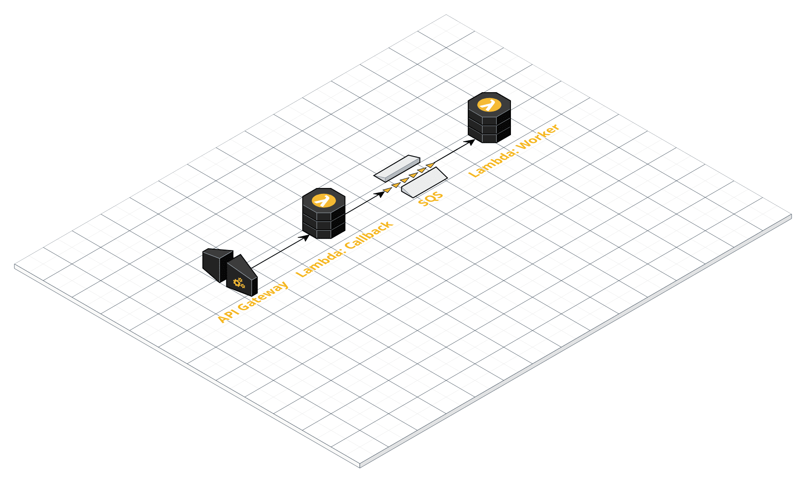
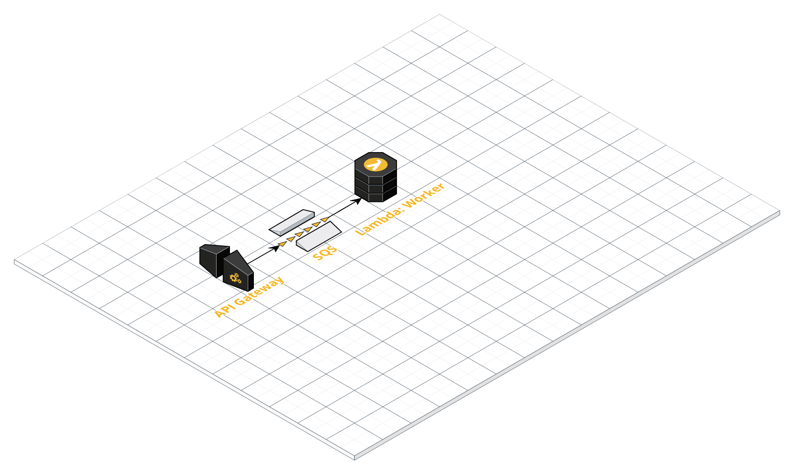

# aws-webhook-processing
Create infrastructure on AWS to handle webhooks with reliability

## Getting Started

### Download Terraform client

- [Terraform Download Page](https://www.terraform.io/downloads.html)
- [Terraform cli documentation](https://www.terraform.io/docs/cli-index.html)

### Create AWS user

create [AWS IAM User](https://docs.aws.amazon.com/IAM/latest/UserGuide/id_users.html) on [AWS IAM](https://aws.amazon.com/pt/iam/) and set:

- access type: Programmatic access
- policies: AdministratorAccess

save `access_key` and `secret_key`


### Configure AWS Provider authentication

run the commands below replacing values for your access and secret keys:

```sh
$ export AWS_ACCESS_KEY_ID="anaccesskey"
$ export AWS_SECRET_ACCESS_KEY="asecretkey"
```

### Let's apply Terraform changes

run the commands below:

```sh
$ cd terraform/
$ terraform init # to download all dependencies
$ terraform plan # to plan a modification
$ terraform apply # to apply this change
```

After the `terraform apply` you can see the API Gateway endpoint in terminal.
Use this url to make a HTTP POST

## Detroy infrastructure

run `terraform destroy` to clean up.

## Architecture

The architecture created is:



- **API Gateway** receive HTTP request (Webhook endpoint) and send to **Lambda Callback**
- **Lambda Callback** write request's body in **SQS Queue**
- A new event in **SQS Queue** start the **Lambda Worker**
- **Lambda Worker** process the message

This architecture works, but we can simplify to:



- **API Gateway** receive HTTP request (Webhook endpoint) and write it in **SQS Queue**
- A new event in **SQS Queue** start the **Lambda Worker**
- **Lambda Worker** process the message
